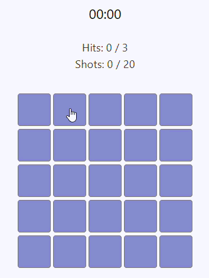

[](LICENSE)


# ⚓ Battleship (5×5)

A classic naval battle board game implemented in React with responsive design and multiple difficulty levels.

**Authors:** Battleship React Game Contributors

[](public/gifs/gameplay.gif)

## Installation and Setup

### 1. Clone the Repository

```bash
git clone https://github.com/Serhii5555/battleship-react-game
cd battleship-react-game
```

### 2. Install Dependencies

```bash
cd battleship
npm install
```

### 3. Run in Development Mode

```bash
npm run dev
```

The application will be available at: `http://localhost:5173` (port may vary)

## Available Commands

| Command         | Description                                               |
| --------------- | --------------------------------------------------------- |
| `npm run dev`   | Run in development mode with HMR (Hot Module Replacement) |
| `npm run build` | Build the project for production                          |
| `npm run lint`  | Check code with ESLint                                    |

## 📚 Documentation

The project uses **Docusaurus** for full documentation.  
Documentation source: [/battleship-docs](battleship-docs)

## Dependencies

### Production Dependencies

- `@hookform/resolvers` - integration with React Hook Form
- `@tailwindcss/vite` - Tailwind CSS Vite integration
- `framer-motion` - animation library
- `lucide-react` - icon set
- `react` - core library
- `react-cookie-consent` - GDPR-compliant cookie consent management
- `react-dom` - DOM manipulation
- `react-hook-form` - form state management
- `react-router-dom` - client-side routing
- `yup` - schema validation
- `zustand` - state management

### Development Dependencies

- `@types/react` - TypeScript types for React
- `@types/react-dom` - TypeScript types for React DOM
- `@types/node` - TypeScript types for Node.js
- `@vitejs/plugin-react` - Vite React plugin
- `autoprefixer` - CSS vendor prefix processing
- `eslint` and plugins - code linting
- `postcss` - CSS processing
- `tailwindcss` - CSS framework
- `typescript` - static typing
- `vite` - build tool

## 📄 Documentation & Legal

### User Documentation

- **[User Guide](USER_GUIDE.md)** – Complete user guide with game instructions, features, tips, and troubleshooting

### Legal & Compliance

- **This game is GDPR-compliant with built-in cookie consent management.**
- [Privacy Policy](PRIVACY_POLICY.md)
- [GDPR Guide](GDPR.md)
- [EULA](EULA.md)

## License

BattleshipGame is licensed under the MIT License.

The MIT License is a permissive open source license that allows anyone to use, modify, distribute, and sublicense the project with minimal restrictions. The only requirement is that the original copyright and license notice be included in all copies or substantial portions of the software.

For the full license text, see:

- **[LICENSE](LICENSE)** — MIT License for the project
- **[DEPENDENCIES_LICENSES](DEPENDENCIES_LICENSES.md)** — Complete license list for all third-party dependencies used in BattleshipGame

---

**Copyright © 2026 Battleship React Game Contributors**

All rights reserved.
